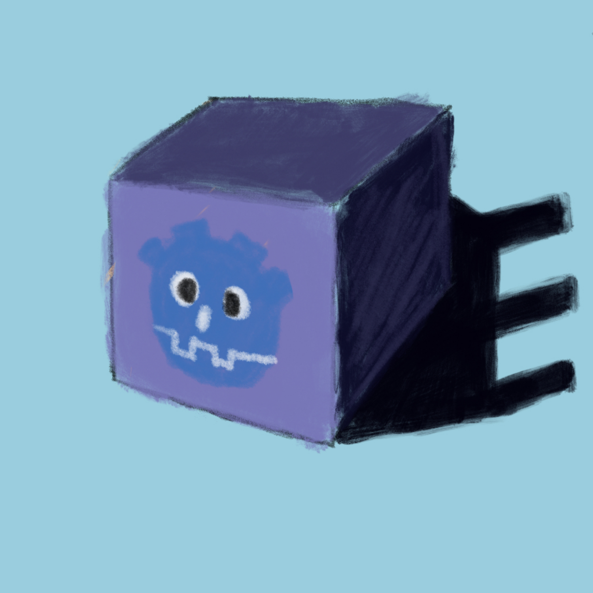

	
	<h3>Godot Interaction System</h3>
	

	
A simple interaction system for Godot 4. Works with 2D and 3D.

> [!NOTE]
> As of version 2.0, the extension is written in C#.
> The version in GDScript is no longer supported, you can find the latest version written in GDScript [here](https://github.com/MASSHUU12/godot-interaction-system/tree/v1.5.0).

## Features

-   `Interactor2D/3D`: Used to interact with `Interactables`.
-   `CharacterInteractor2D/3D`: Simplifies the process of creating a `player character`.
-   `Interactable2D/3D`: Used to create `interactive` objects.
-   `InteractableProp3D`: Allows to quickly create interactive objects with `outline` and `highlight` effects.

## Prerequisites

-   [.NET SDK](https://dotnet.microsoft.com/download)
-   [.NET enabled Godot 4.0^](https://godotengine.org/download)

## Usage

> [!NOTE]
> Detailed information on each class can be found in the individual source files
> and in [docs](./docs) folder.

You can find an example of using the above classes in the [examples](../../examples/) folder.

It is a good practice to put everything related to the interaction system on a separate layer/mask.

## External assets

The project uses the following shaders from the [Godot Shaders](https://godotshaders.com/shader/collectable-item-shining-highlight/) website under [MIT license](https://opensource.org/licenses/MIT):

-   [Item Highlighter](https://godotshaders.com/shader/collectable-item-shining-highlight/) used in example scene.

## License

Licensed under [MIT license](./LICENSE).
